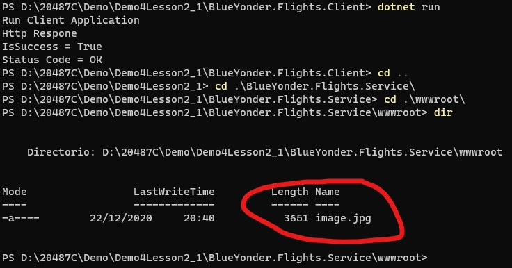

# Module 4: Extending ASP.NET Core HTTP services

# Lesson 2: Customizing Controllers and Actions

### Demonstration: Creating Asynchronous Actions

- Abrimos el proyecto AsynchronousActionsVisual Studio Code

- Restauramos el proyecto

- En el subproyecto **BlueYonder.Flights.Service** En la clase PassengerController

  - Añadimos el parametro iFormFile en la accion UpdatePhoto

- Ejecutamos el proyecto **BlueYonder.Flights.Service**

- Ejecutamos el proyecto **BlueYonder.Flights.Client**

- Verificamos que el status code es OK y que la imagen se encuentra bajo wwwroot

  

